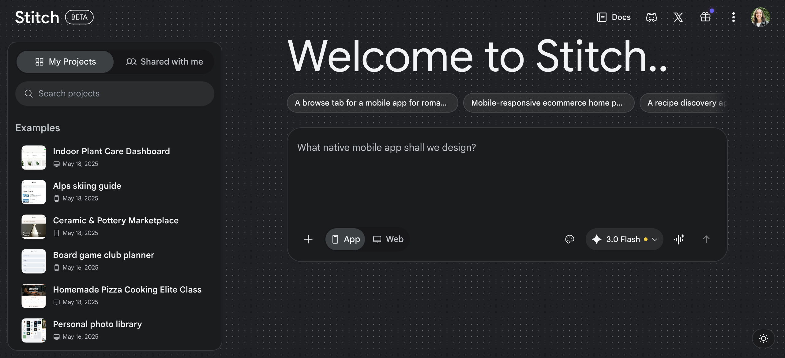

# Conga — Pricing Analysis

> Last reviewed: 2026-03-23
> Pricing page URL: https://conga.com/pricing

## Pricing Model

Enterprise-only, custom-quoted pricing through direct sales. No self-serve signup and no published tiers -- pricing is bundled per Conga product line (CLM, Composer, Sign) and scoped to seat count, document volume, and Salesforce edition. This is consistent with Conga's pattern of selling through account executives rather than a self-serve funnel.

## Tiers

| Tier | Price | Key Inclusions | Target User |
|------|-------|----------------|-------------|
| Enterprise (Custom) | Contact sales | Salesforce-native document generation & extraction, contract lifecycle workflow, e-signature, SSO/SAML, audit logging, SOC 2, dedicated implementation partner | Enterprise orgs standardizing contract automation on Salesforce |

## Free Tier

No free tier exists. Conga offers time-limited sandbox trials arranged directly through sales, gated behind a discovery call.

- **Included:** N/A -- no self-serve tier
- **Limits:** N/A
- **Upgrade triggers:** N/A -- all usage requires a signed contract

## Enterprise

Custom pricing, scoped per deployment. Minimum commitment is typically annual, sized to seat count and Salesforce edition.

- **Pricing model:** Per-seat + per-product-line bundle, quoted by an account executive
- **Minimum commitment:** Annual contract, enterprise procurement cycle
- **Notable terms:** Given Conga's distribution through the Salesforce AppExchange and existing enterprise agreements, pricing is frequently bundled into a customer's broader Salesforce spend, with implementation typically requiring a certified partner.

## Comparison to example_product

| Dimension | Conga | example_product | Advantage |
|-----------|---------------|-------|-----------|
| Entry price | Custom only, no self-serve | Free tier available, paid tiers for more | example_product |
| Per-seat cost | Bundled, opaque | Per-seat pricing, published | example_product |
| Extraction accuracy for CRM-tied data | Strong (Salesforce-native) | Strong, CRM-agnostic | Depends on stack |
| Enterprise flexibility | SSO, audit logs, team mgmt, compliance | SSO, audit logs, team mgmt, compliance | Neutral |

**Summary:** Conga has no public pricing, which reflects its enterprise-only, consultant-led go-to-market. It offers strong extraction and routing accuracy when contract data already lives in Salesforce, and inherits genuine enterprise credibility from long-standing deployments in regulated industries. However, it has no self-serve path, no published pricing, and no custom domain support for published portals -- workflows stay inside the Salesforce shell rather than becoming standalone branded portals.

The primary risk is Conga's Salesforce distribution power. If a prospect's contract process already lives in Salesforce, Conga becomes the default add-on. example_product's advantages -- CRM-agnostic extraction, a faster and more modern workflow-building experience, self-serve pricing, and a real preview/refinement loop before publish -- are the key differentiators that justify choosing example_product even inside Salesforce-heavy accounts.
