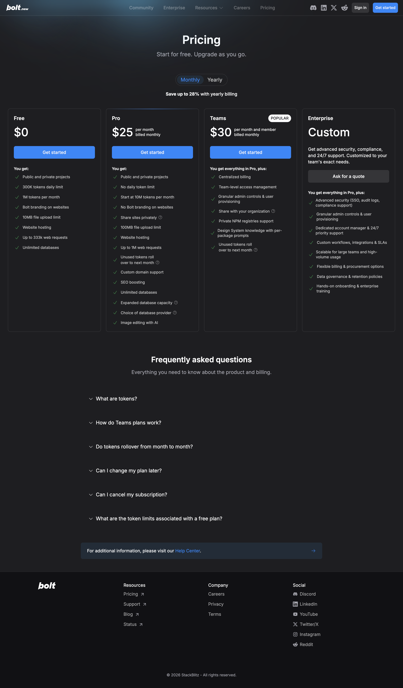
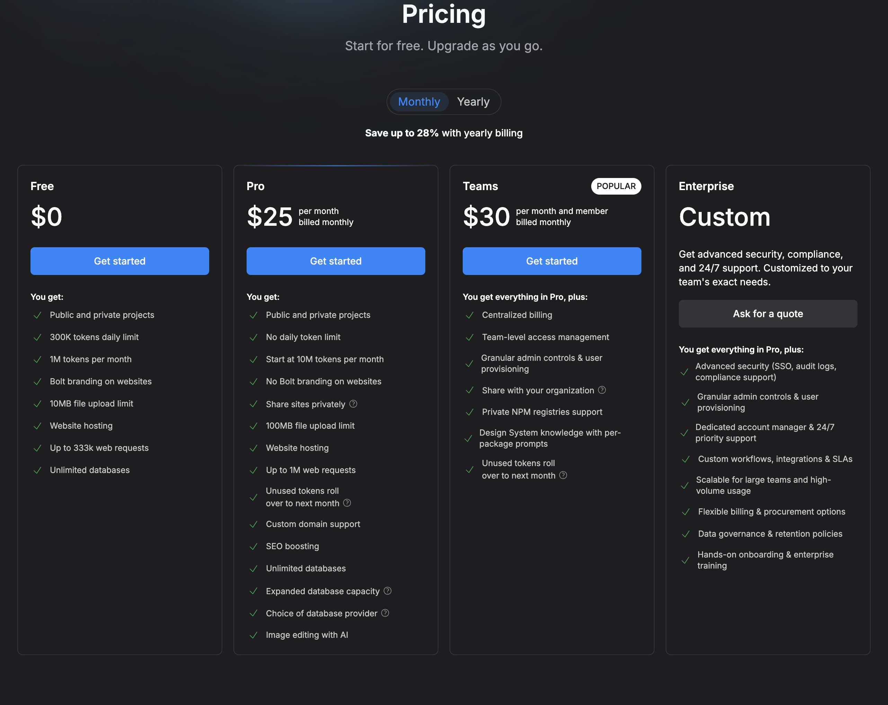
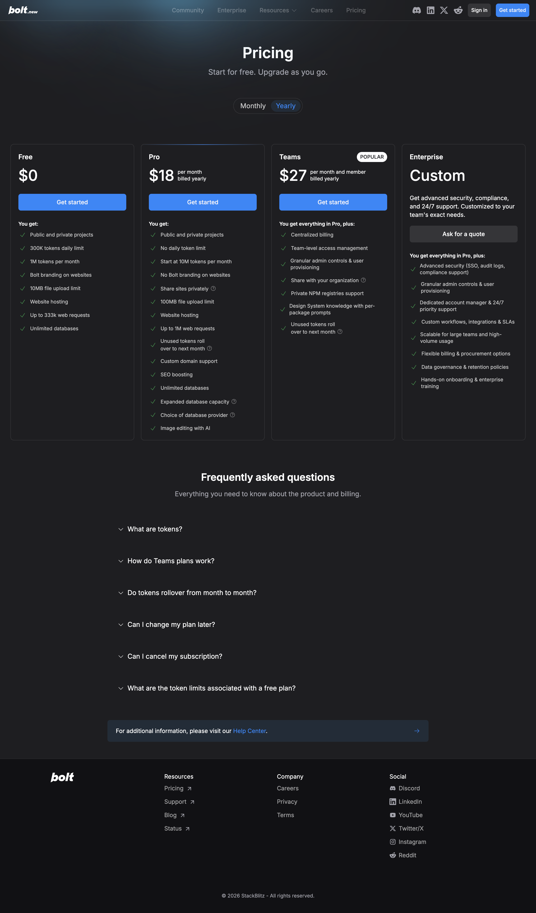
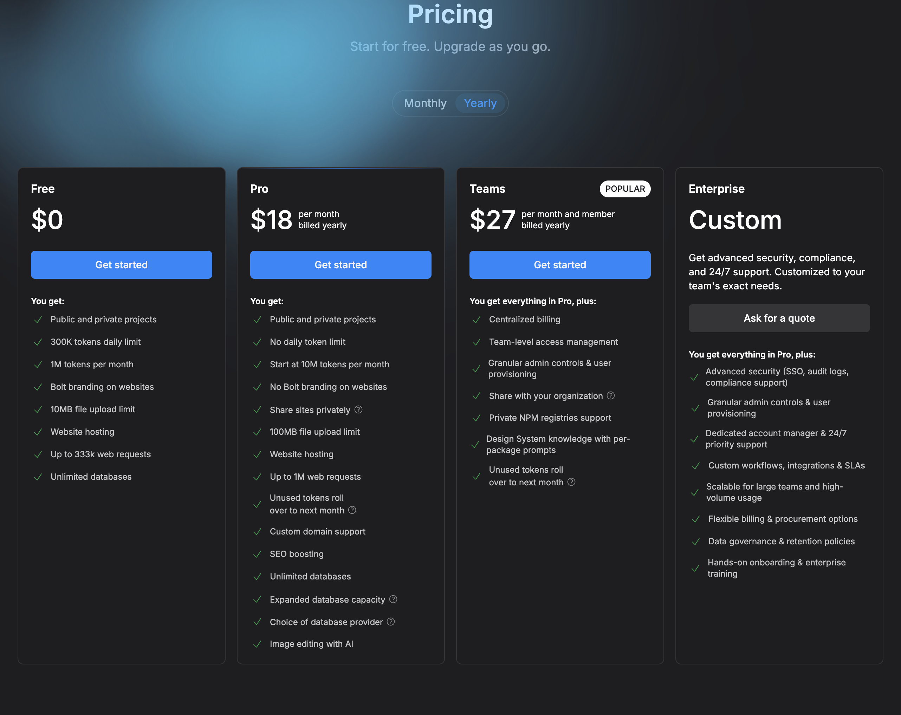
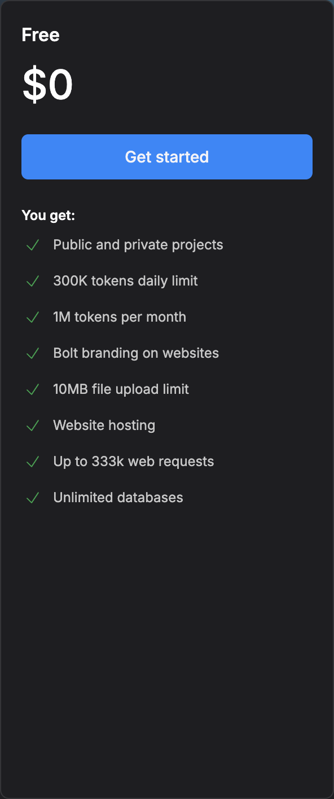
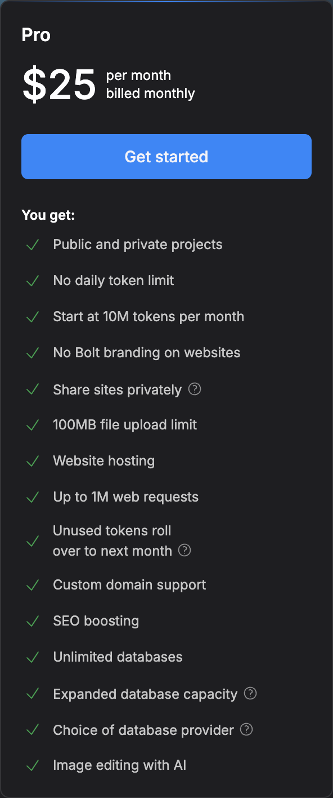
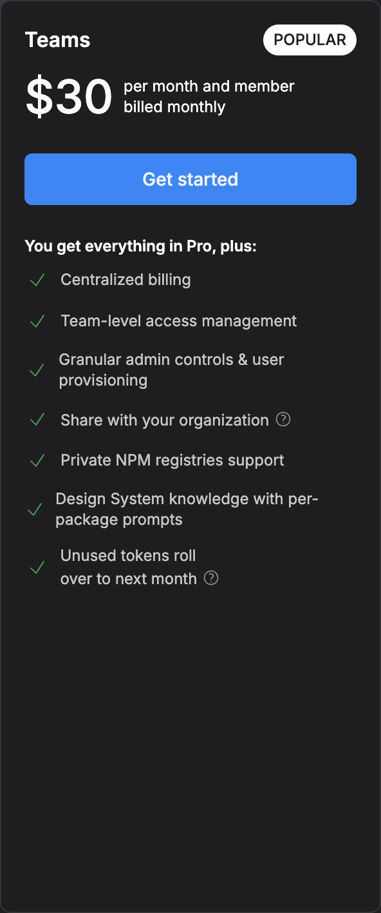
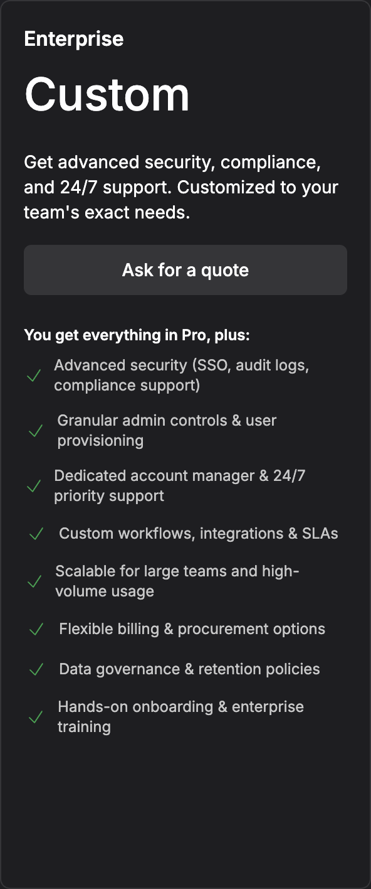

# DocuSign — Pricing Model and Tiers

> Pricing page: https://www.docusign.com/pricing

## Pricing Model

Hybrid — per-seat flat fee + envelope-based usage. Free tier provides a monthly envelope allowance with a per-envelope signer cap. Paid tiers offer higher envelope limits with overage billing. Teams tier is per-seat. Envelopes are consumed per document sent for signature, regardless of page count.

## Tiers

| Tier | Price | Key Inclusions | Limits |
|------|-------|----------------|--------|
| Free | $0/mo | 3 envelopes/mo, basic field tagging, mobile signing, DocuSign branding on portal, 10MB file upload limit, standard hosting | 3 envelopes/mo, single user |
| Pro | $25/user/mo | 25 envelopes/mo, custom branding removed, reusable templates, in-person signing, 100MB file upload limit, custom domain support, priority email support | — |
| Teams | $45/user/mo (billed monthly) | Everything in Pro + shared template library, bulk send, centralized billing, team-level access management, granular admin controls & user provisioning, envelope overage rollover | — |
| Enterprise | Custom | Everything in Teams + SSO/SAML, audit logs, advanced compliance workflows, dedicated account manager & 24/7 priority support, custom integrations/SLAs, data governance & retention policies, hands-on onboarding & enterprise training | Contact sales |

### Screenshots

#### Monthly Pricing

#### Yearly Pricing

#### Tier Details

| Tier | Screenshot |
|------|------------|
| Free |  |
| Pro |  |
| Teams |  |
| Enterprise |  |

## Free Tier Limits

3 envelopes per month, single user only. Basic field tagging (no AI-assisted extraction). DocuSign branding displayed on the signing portal. 10MB file upload limit. Standard hosting included. No custom domains, no bulk send, no reusable templates.

## Enterprise Pricing

Custom pricing — requires contacting sales. Enterprise includes SSO/SAML, audit logs, advanced compliance workflows (ESIGN/UETA/eIDAS attestations), a dedicated account manager with 24/7 priority support, custom integrations and SLAs, data governance and retention policies, and hands-on onboarding with enterprise training.

## Comparison to example_product

DocuSign uses an envelope-based model (3 free, 25 at Pro) vs. example_product's page/credit model. DocuSign's Teams tier at $45/user/mo is more expensive than example_product Teams at comparable feature depth.

Key differences:
- **DocuSign advantage:** Near-universal signer familiarity reduces drop-off on external-facing signing requests. Mobile signing polish. Bulk send at Teams tier.
- **DocuSign disadvantage:** Envelope caps can be restrictive for high-volume intake use cases. No true extraction/OCR beyond basic field tagging. No staged preview environment before publish.
- **example_product advantage:** True AI extraction with confidence scoring, deeper workflow branching/routing logic, and staged preview environments before publish.
- **example_product advantage:** Stronger collaboration (real-time multiplayer editing) and shared clause/field block library at comparable price points.
