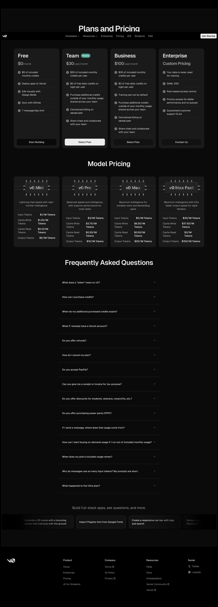
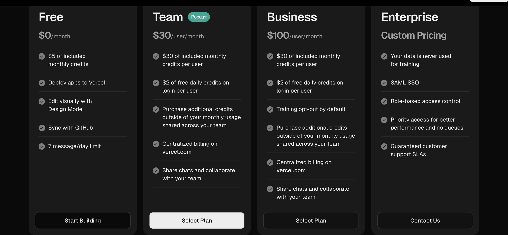
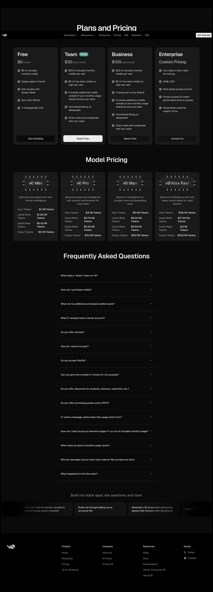
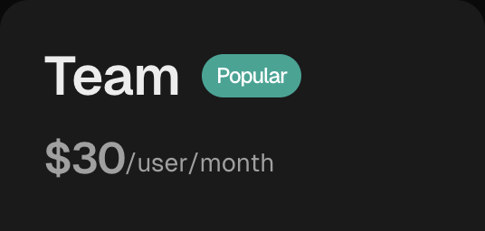
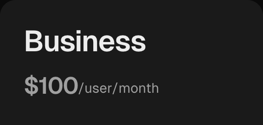
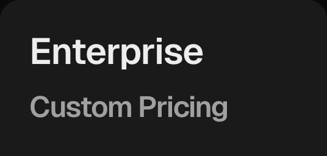

# Dropbox Sign -- Pricing Analysis

**URL:** https://sign.dropbox.com/pricing
**Date captured:** 2026-03-23

## Model

Per-seat pricing with a monthly signature-request allowance. Each user gets a capped number of signature requests per month; additional requests require an upgrade rather than a-la-carte purchase. No usage credits beyond the signature-request cap.

## Tiers

| Tier | Price | Key Inclusions | Limits |
|---|---|---|---|
| Free | $0/mo | 3 signature requests/mo, mobile app, basic audit trail, sync with Dropbox | 3 requests per month |
| Essentials | $20/user/mo | Unlimited signature requests, custom branding, in-person signing, reusable templates, team folder sharing | — |
| Standard | $30/user/mo | Everything in Essentials + bulk send, multiple team members, roles & permissions, integrations with CRM/storage apps | — |
| Enterprise | Custom pricing | SAML SSO, advanced admin console, audit logs, dedicated account manager, guaranteed support SLA | Contact sales |

### Screenshots

#### Monthly Pricing

#### Yearly Pricing

#### Tier Details

| Tier | Screenshot |
|------|------------|
| Free |  |
| Essentials |  |
| Standard |  |
| Enterprise |  |

## Free Tier

3 signature requests per month. Basic audit trail per signature. Mobile app included. Syncs with Dropbox file storage. No custom branding, no reusable templates, no bulk send, no team features.

## Enterprise

Custom pricing -- requires contacting sales. SAML SSO included. Advanced admin console. Audit logs. Dedicated account manager. Guaranteed support SLA.

## Comparison

Dropbox Sign's pricing is competitive at the entry paid tier ($20/user/mo) but the product does nothing beyond signature routing -- there is no extraction, no workflow builder, and no publishing pipeline to compare against example_product's broader feature set.

Key differences:
- **Dropbox Sign advantage:** Fastest, simplest signature-request flow in the category. Tight Dropbox file sync. Strong developer API.
- **Dropbox Sign disadvantage:** Zero extraction capability. No workflow/routing builder. No enterprise features below custom Enterprise pricing. Only 3 free requests/mo, the most restrictive free cap among competitors.
- **example_product advantage:** Full document lifecycle automation (extraction, routing, approvals, signature, publishing), not just the signature step. More generous free tier. Enterprise features available progressively, not gated entirely behind custom pricing.
- **example_product advantage:** Staged preview environments and workflow branching that Dropbox Sign has no equivalent for.
