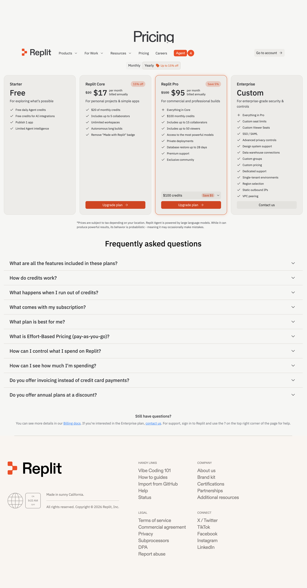
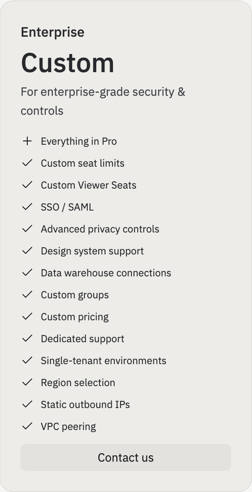

# Ironclad -- Pricing Analysis

**URL:** https://ironcladapp.com/pricing
**Date captured:** 2026-03-23

## Model

Per-seat subscription combined with workflow-complexity tiering -- no credit-based usage. Higher tiers unlock more workflow templates, additional collaborator seats, and deeper repository/reporting capability. Pricing is quoted rather than self-serve at every tier; the published tiers below reflect Ironclad's typical packaging as reported by customers and partners.

## Tiers

| Tier | Price | Key Inclusions | Limits |
|---|---|---|---|
| Starter (Free) | Not offered | -- | No free tier |
| Essentials | $30/user/mo (est., quoted) | Core workflow designer, e-signature, up to 5 workflow templates, basic reporting | Quoted, minimum seat count applies |
| Growth | $75/user/mo (est., quoted) | Unlimited workflow templates, up to 25 collaborators, clause library, advanced approval routing, CRM integrations | 25 collaborators |
| Enterprise | Custom | Everything in Growth + custom seat limits, SSO/SAML, advanced audit logging, dedicated implementation team, custom integrations, data residency options, uptime SLA | Contact sales |

## Free Tier

No free tier is offered. Prospective customers get a guided demo and time-limited sandbox trial arranged through sales rather than open self-serve signup.

## Enterprise

Custom pricing. Includes everything in Growth plus:
- Custom seat limits
- SSO/SAML authentication
- Advanced audit logging
- Dedicated implementation team
- Custom integrations
- Data residency options
- Uptime SLA

## Comparison

Ironclad's lack of a free or low-commitment self-serve tier is a meaningful barrier to entry compared to example_product's free tier and $29/mo Pro plan. The jump from Essentials to Growth is steep (roughly 2.5x), which may push cost-sensitive legal teams to negotiate hard or look elsewhere.

Ironclad's quoted-pricing model ties cost to a sales conversation at every tier, making budgeting harder for smaller teams. example_product's published, self-serve pricing is an advantage for budget-conscious buyers who want to get started without a sales cycle.

**Key Ironclad advantages:** Full contract-lifecycle workspace, real-time collaborative redlining, deep clause-level AI extraction, strong CRM/e-signature integration.

**Key example_product advantages:** Broader document-type coverage (not contracts-only), self-serve published pricing, custom domain support for publishing, faster time-to-first-workflow for non-legal teams.

| Dimension | Ironclad | example_product | Advantage |
|-----------|-------|-------|-----------|
| Entry price | No free tier, quoted | Free tier + $29/mo Pro | example_product |
| Mid-tier price | ~$75/user/mo (Growth) | Lower | example_product |
| Pricing model | Quoted at every tier | Published, self-serve | example_product |
| Document scope | Contracts-only | Contracts, invoices, forms, POs | example_product |
| Enterprise features | SSO, audit logs, data residency | SSO, audit logs, team mgmt | Neutral |
| Collaboration | Real-time redlining | Real-time multiplayer editing | Neutral |
| Extraction quality | Strong for clauses | Strong across document types | example_product |
