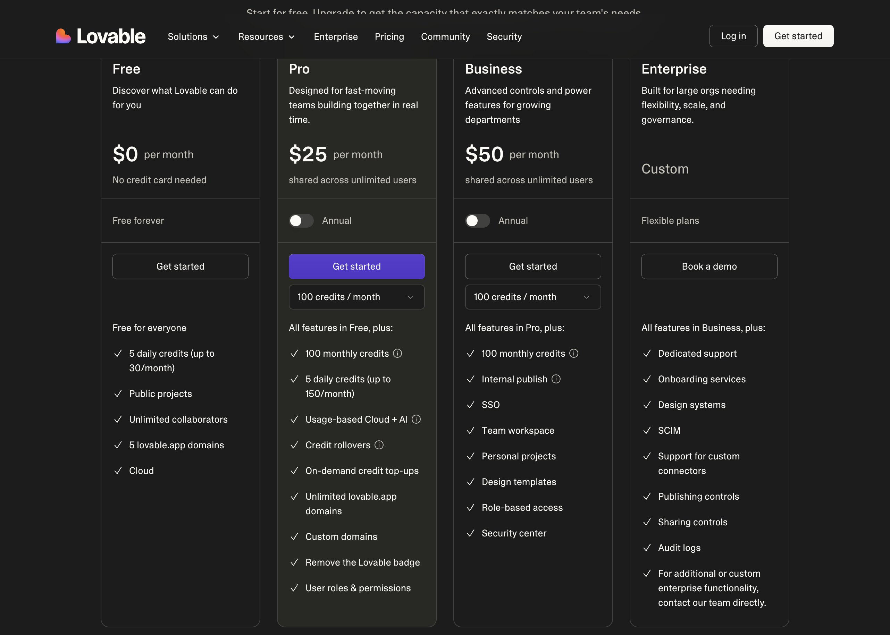
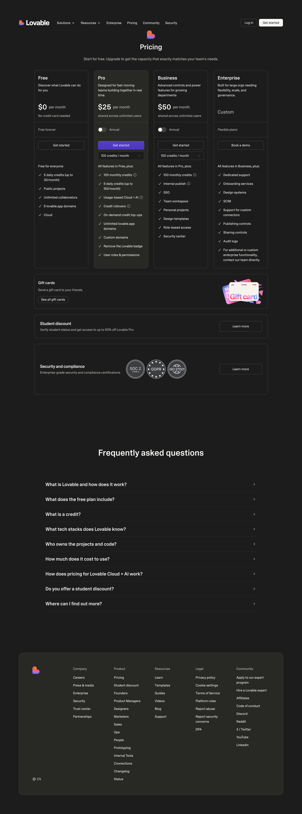
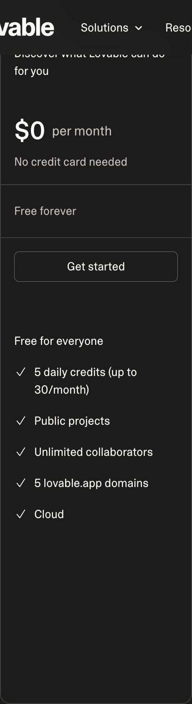
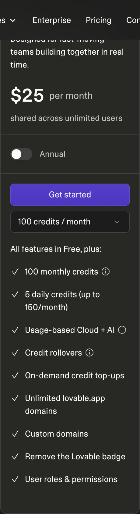
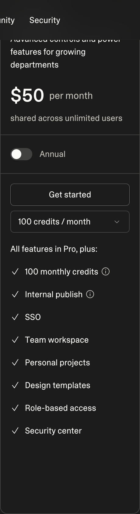
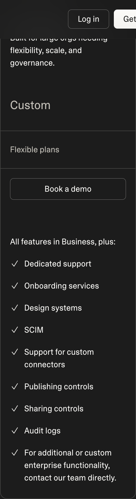

# PandaDoc — Pricing Model and Tiers

## Pricing Model

Per-seat flat fee with document-count add-ons available at lower tiers. No credit/usage-based consumption — pricing is driven by seat count and feature tier rather than volume of documents processed. On-demand e-signature-only add-ons are available for teams that don't need the full document builder.

## Tiers

| Tier | Price | Key Inclusions | Limits |
|------|-------|----------------|--------|
| Free | $0/mo | Unlimited e-signatures, 1 user, basic templates, mobile app, unlimited document uploads | 1 user, no document builder |
| Pro | $19/user/mo (billed annually) | Unlimited documents & templates, custom branding, payment collection, content library, real-time tracking & notifications, CRM integrations | — |
| Business | $49/user/mo (billed annually) | All Pro features + custom workflows & approvals, bulk send, team workspace, conditional content blocks, API access, salesforce/HubSpot deep integrations | — |
| Enterprise | Custom | All Business features + SSO, single-tenant options, advanced roles & permissions, dedicated success manager, custom contract terms, uptime SLA | Contact sales |

### Screenshots

#### Monthly Pricing

#### Yearly Pricing

#### Tier Details

| Tier | Screenshot |
|------|------------|
| Free |  |
| Pro |  |
| Business |  |
| Enterprise |  |

## Free Tier Limits

Single user only. Unlimited e-signatures and document uploads, but no access to the document builder or templates beyond basic ones. No custom branding, no payment collection, no CRM integrations. Mobile app included.

## Enterprise Pricing

Custom pricing, requires contacting sales. Enterprise includes everything in Business plus SSO, single-tenant deployment options, advanced roles and permissions, a dedicated success manager, custom contract terms, and an uptime SLA. No public pricing is listed.

## Comparison to example_product

PandaDoc's Pro tier at $19/user/mo undercuts example_product's entry paid tier, making it attractive for price-sensitive sales teams sending simple outbound documents. However, PandaDoc has no meaningful extraction capability for inbound/uploaded paperwork — it is built to generate documents, not extract structured data from them.

Key differences:
- **PandaDoc advantage:** Lower entry price. Native payment collection at Pro tier. Strong template design quality out of the box.
- **PandaDoc disadvantage:** No AI extraction on inbound documents. No staged preview environment. SSO gated behind custom Enterprise pricing only.
- **example_product advantage:** True extraction quality (OCR, field/clause detection, confidence scoring) on uploaded and scanned documents, not just outbound template-fill.
- **example_product advantage:** Deeper workflow branching/routing logic and real-time collaborative editing at comparable price points.
